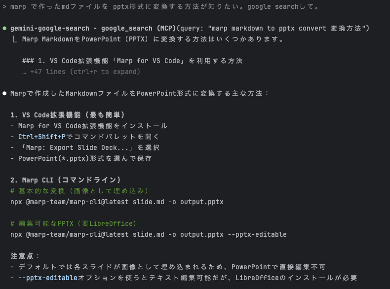

<style>
  /* 通常のスライドは上詰めでコンテンツ開始位置を固定 */
  section {
    display: flex;
    flex-direction: column;
    justify-content: flex-start;
    padding-top: 150px; /* h1の高さ分を考慮してコンテンツ開始位置を設定 */
  }
  
  /* 通常のスライドのh1は左上に固定 */
  h1 {
    position: absolute;
    top: 50px;
    left: 50px;
    margin: 0;
    z-index: 10;
  }
  
  /* 中央揃えクラスが適用されたスライドは中央配置 */
  section.centered {
    display: flex;
    flex-direction: column;
    justify-content: center;
    align-items: center;
    text-align: center;
    padding-top: 0; /* 中央揃えスライドはパディングを解除 */
  }
  
  /* 中央揃えスライドのh1は通常の位置に戻す */
  section.centered h1 {
    position: static;
    margin: 0 0 20px 0;
  }
</style>

<!-- _class: centered -->

#  初学者向け！Claude Code × MCP
### AIエージェント開発課 佐藤淳吏

---

# 自己紹介

- 2018年新卒入社 8年目
  - 楽楽精算開発部→AI開発課→AIエージェント開発課
- モンハンとギターが好き
- 詳細はこちらを参照
  - https://docs.google.com/presentation/d/16ZivXJ7oHukq8AMnGTVe2u1N_fM4NG_aKfCzHacqyGU/edit

---

# このスライドはMarpで作りました
- 骨組みだけ作ってClaudeが爆速でスライド作成
- スタイルの修正も gemini-google-search + claude でエラーなく完了
- `--pptx-editable`で出力 → pptx を Googleスライドで読み込んで変換
  - この機能はまだβ版だからかイマイチ。。
    - 要素が全部バラバラで出力されるので修正はやりにくい
    - URLや画像の埋め込みは抜け落ちる

---

# Claude Code

## 言わずもがな
https://www.anthropic.com/claude-code
npm でインストール！
```
npm install -g @anthropic-ai/claude-code
```

---
<!-- _class: centered -->

# MCPを設定する

---

# Cursor などでのやり方

`.cursor/mcp.json` に以下のような定義を書く
```json
{
  "mcpServers": {
    "server-name": {
      "command": "npx",
      "args": ["-y", "mcp-server"],
      "env": {
      }
    }
  }
}
```

---

# Claude Code では

**コマンド一発**でMCPサーバを簡単設定できる！(ものもある)
https://zenn.dev/karaage0703/articles/3bd2957807f311
- 追加：   `claude mcp add [mcp-xxx] -s [scope] -- [command]`
- 削除：    `claude mcp remove [mcp-xxx]`

---

# スコープは間違えると面倒

- PC内どこでも利用可能にするなら `-s user`
- プロジェクトで共有したいなら `-s project`
- プロジェクトローカルのみで良いなら `-s local`
  - デフォルトは `local`

---

# MCP一覧

以下で確認可能
- `claude mcp list`
- `claude`で対話に入ってから `/mcp`

---
<!-- _class: centered -->
# よく使うMCP

---

# mcp-gemini-google-search

https://github.com/yukukotani/mcp-gemini-google-search
Gemini の**Web検索**をClaude Codeから使用

**ユースケース** :
- ライブラリやツールの最新情報を取得
- Claudeのweb_searchより早い+精度が良い

**設定:**
```bash
claude mcp add gemini-google-search  -e GEMINI_API_KEY="your-api-key"  -- npx mcp-gemini-google-search
```

---

# 使用例
claudeだけだと解決できなそうな時にgoogle searchしてもらう


---


# MCP-GoogleDrive

https://github.com/Takatoshi-Miura/MCP-GoogleDrive
社内ラジオで紹介のあった三浦さん作のMCPです！
https://docs.google.com/presentation/d/1CXAZ115lt6rBTlPcvJjmj8AwPmwEJ-ENSypKK6QZLDs/edit

**ユースケース** : 
- ファイル検索
- スプレッドシートやドキュメントの内容・コメント取得
- グラフ作成・データ分析
- スプレッドシートをmarkdownやドキュメントに変換

設定例:
```bash
claude mcp add mcp-google-drive -- node ~/MCP-GoogleDrive/mcp-google-drive/build/index.js
```

---

# 使用例
DB定義を確認してSQLを作成し、ローカルDBでテスト

---

# github-mcp-server

https://github.com/github/github-mcp-server
Github上から必要な情報を取得

**ユースケース** : 
- issue/discussion の内容をAIコーディングに活用
- PR を確認してレビュー
- (Copilotが要らなくなる)

設定例:
```bash
claude mcp add github -- docker run -i --rm -e GITHUB_PERSONAL_ACCESS_TOKEN ghcr.io/github/github-mcp-server
claude mcp update github -e GITHUB_PERSONAL_ACCESS_TOKEN=your_github_pat
```

---

# 使用例

---

# playwright-mcp
https://github.com/microsoft/playwright-mcp
**ユースケース** : Webブラウザの自動操作
- Webサイトのテスト自動化
- スクレイピングとデータ収集
- 動的コンテンツの取得

設定例:
```bash
claude mcp add playwright npx @playwright/mcp@latest
```

---
<!-- _class: centered -->
# 使ってみたいMCP

---

# context7-mcp
**ユースケース** : ライブラリの最新ドキュメント取得
- Next.js、React、Vue等のフレームワーク仕様確認
- APIドキュメントとサンプルコード取得
- ライブラリのバージョン別ドキュメント参照

設定例:
```bash
claude mcp add context7 -s project -- npx -y @upstash/context7-mcp
```

---

# youtube-mcp

**ユースケース** : YouTube動画の字幕取得
- 技術チュートリアルの内容把握
- カンファレンス動画の要約作成
- 動画の内容を文字で確認

設定例:
```bash
claude mcp add youtube -s project -- npx @anaisbetts/mcp-youtube
```

---

# o3-mcp
**ユースケース** : o3の推論能力を活用した高度な問題解決
- 複雑なアルゴリズムの設計
- 数学的証明やロジック問題の解決
- 高度なデバッグやコード最適化

設定例:
```bash
$ claude mcp add o3 \
	-e OPENAI_API_KEY=your-api-key \
	-e SEARCH_CONTEXT_SIZE=medium \
	-e REASONING_EFFORT=medium \
	-e OPENAI_API_TIMEOUT=60000 \
	-e OPENAI_MAX_RETRIES=3 \
	-- npx o3-search-mcp
```

---

# 番外編 : MCPを作る

- 

---

# 終わりに

- MCPは
- なければ作る(Claude Codeに作らせる)